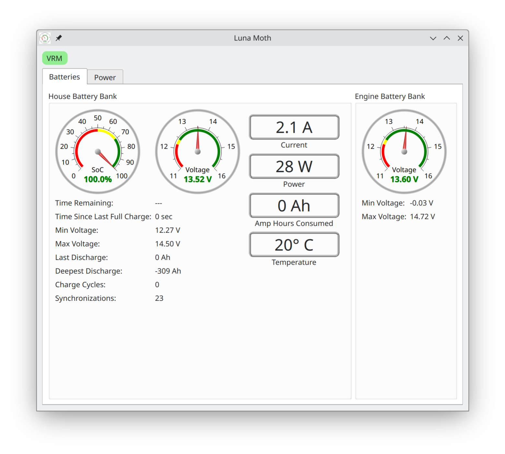
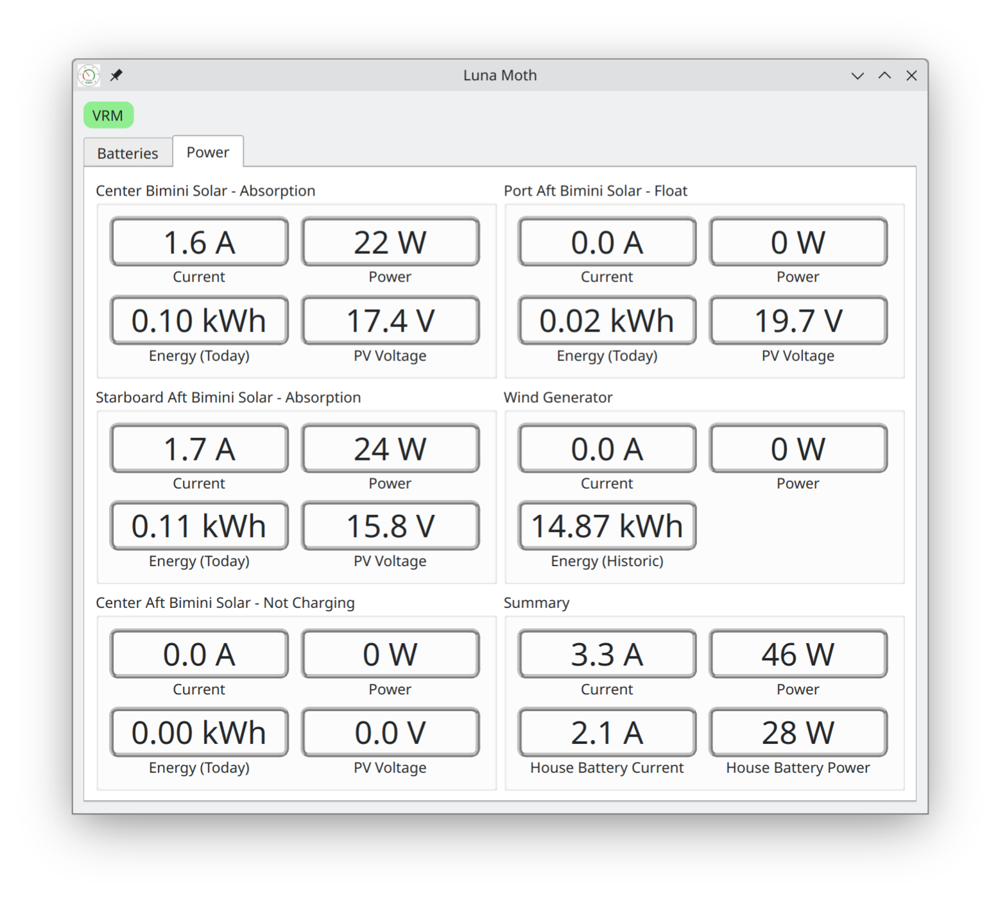
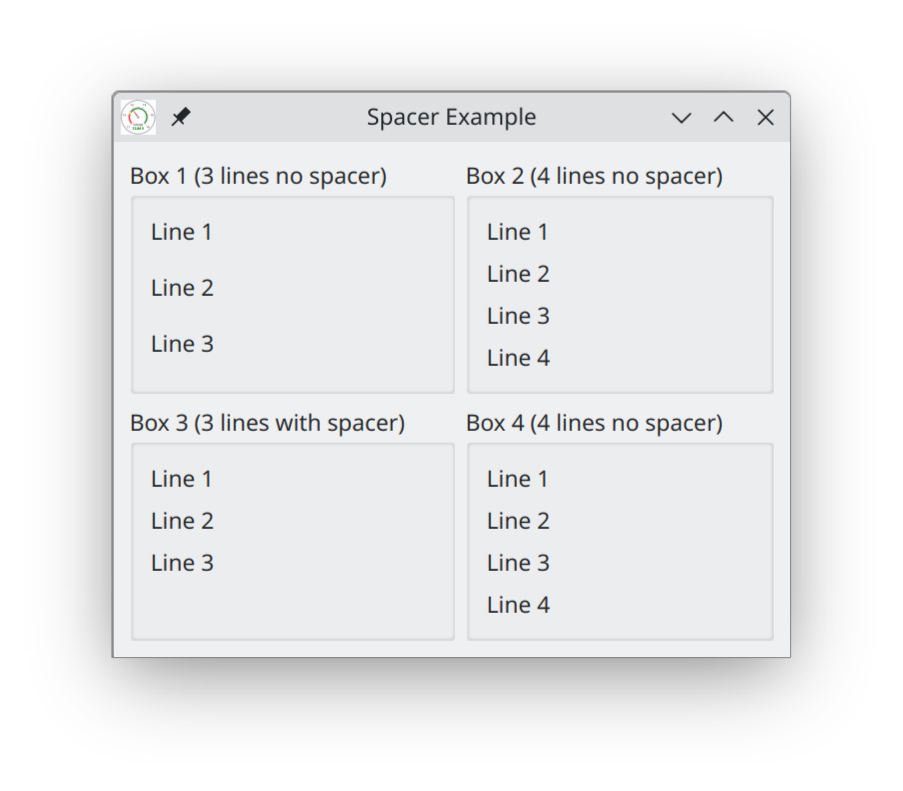

# LunaDash - A MQTT Dashboard
A Qt based Linux dashboard for MQTT sourced Data.

## Table of Contents
* [General Info](#general-information)
* [Technologies Used](#technologies-used)
* [Features](#features)
* [Screenshots](#screenshots)
* [Setup](#setup)
* [Usage](#usage)
* [Project Status](#project-status)
* [Room for Improvement](#room-for-improvement)
* [Acknowledgements](#acknowledgements)
* [Contact](#contact)
* [License](#license)


## General Information
This project was created to fill the need for a good, lightweight, MQTT dashboard
for Linux as existing options were either horribly outdated, or too slow to be of
practical use. The focus was for a clean, user experience at while in use with
display creation being a secondary concern. Current the project accepts dashboards
created via XML files which define server connections, topics being subscribed to,
and a widgets to display the gathered information.

## Technologies Used
- MQTT
- XML
- Qt

## Features
- Support for simultaneous connections to multiple MQTT brokers with data the
ability to mix data display from each.
- A rich set of display widgets ranging from text labels to numeric gauges.
- Paged output with tab bars.
- Powerful data transformers which allow manipulation and combination of data
before it's displayed.

## Screenshots



## Setup
Currently the project is only available in source code form. In order to build it,
the Qt development environment must first be installed. See
https://www.qt.io/download-open-source for more information.

Additionally LunaDash requires the Paho MQTT C library, which, depending upon your
distribution, may be as simple as installing paho-c-devel.x86_64. If the library
isn't available in your distribution it will have to be build from scratch, see
https://github.com/eclipse/paho.mqtt.c for details. It's worth noting that the C
version of the library is used by LunaDash, despite the project being C++ based.

A .desktop file and icon are provided with the source. If you want the program to
start up when a dashboard file is opened, you'll need to create a MIME class for
the files. This can be done with

    sudo xdg-mime install LunaDash-ldash.xml

To teach your window manager about LunaDash, you can install its .desktop file
with

    cp LunaDash.desktop /usr/share/applications

The icon for the desktop is installed with

    cp LunaDash-icon-256x256.png /usr/share/pixmaps

The following will set the icon for the .ldash dashboard configuration file mime
class that you set above.

    sudo xdg-icon-resource install --context mimetypes --size 256 LunaDash-icon-256x256.png application-x-ldash

## Usage
LunaDash currently reads its dashboard definitions from XML files (*.ldash). Basic
knowledge of XML data format is required, but there's a pretty involved example
dashboard that can be ripped up and modified as a starting point. An good syntax
aware editor will also make things easier. If you get stuck, it's fine to reach out
for help.

The root element of an .ldash file is always a **Dashboard**. Within the
**Dashboard** you will define elements for the MQTT connections, any
transformations and styles you wish to use, then the elements which describe
how data is to be displayed. Elements are nested with things like connection
elements containing topics and topics containing variable definitions, etc.

Variables are where data received from brokers and results from Transformers are
stored. One or more widgets can display the contents of a variable. The definition
of each of these is described in detail below.

Widgets are laid out in a grid with the upper left widget being at position 0, 0,
the one to its right at position 0, 1, and the one below it at 1, 0. Some widgets
such as a **TabBar** or a **Box** can contain other widgets inside them. Position
of widgets within another widget are specified in relation to the containing
widget.

### MQTTBroker

```xml
<MQTTBroker server="Server Name or IP addr" port="Optional Port #">
    <ClientId ... />                <!-- (Occurrence: 0 or 1) -->
    <User ... />                    <!-- (Occurrence: 0 or 1) -->
    <TLS ... />                     <!-- (Occurrence: 0 or 1) -->
    <StatusVariable ... />          <!-- (Occurrence: 0 or 1) -->
    <Topic ... />                   <!-- (Occurrence: 0 or 1) -->
</MQTTBroker>
```

Defines a connection to a MQTT broker, of which there can be many. Each broker
connection can have a client id to be used by the broker to individually
identify this MQTT client, authentication credentials, status variables, and
a collection of topics to listen to. More details on each of these follows.

If no ClientId information is specified, "LunaDash####" is used where "####"
is a four digit random number.

### ClientId

```xml
<ClientId hostPrefix="Optional boolean" id="Optional base name" randomize="Optional boolean"/>
```

Specifies how LunaDash should identify itself to a particular MQTT broker. If
**hostPrefix** is 'true', the device's name is prepended to the client id used. An
**id** can be used to insert a text string between the optional host name and
an optional random number if **randomize** is 'true'.

It is recommended to either use the default id or one that includes a random
random if there is a chance of multiple instances of LunaDash running at the
same time since brokers will disconnect a client connection when a new one with
the same id comes in. With LunaDash retrying connections, this can result in
the active connection ping ponging between instances.

Overriding the default client id to include something descriptive can be handy in
debugging what is happening on a broker.

### User

```xml
<User name="Your user name" password="Your password"/>
```

Specifies an optional user name and password for connecting to a MQTT broker
which requires one.

### TLS

```xml
<TLS>
    <serverCertificate file="Path to file"/>
</TLS>
```

An optional way of specifying TLS based authentication with an MQTT broker.
Currently only server certificates are supported. The certificates are stored
in a separate and a path to that file is used in the dashboard definition.
Currently only full path specifications are supported without the use of "~".

### StatusVariable

```xml
<StatusVariable name="Variable name"/>
```

Creates a boolean variable, with the given name, that will contain 'true' if the
MQTT connection is up and running and 'false' otherwise. This can be used with
a widget to give the user feedback as to whether or not topic updates are
expected.

### Topic

```xml
<Topic path="MQTT topic path">
    <JSON ... />                    <!-- (Occurrence: typically 0 or 1) -->
    <Double ... />                  <!-- (Occurrence: typically 0 or 1) -->
    <String ... />                  <!-- (Occurrence: typically 0 or 1) -->
    <Bool ... />                    <!-- (Occurrence: typically 0 or 1) -->
</Topic>
```

Subscribes to a topic on the broker and sets up how update data is used. A topic
would typically either have a **JSON** element which defined how a JSON encoded
topic is interpreted, or a double (floating point number), string, or boolean
variable which would receive the update value. Defining more than one variable
for a **Topic** is supported and can be a way to aid in debugging unexpected
topic updates. Having both a **JSON** decoding and one or more variables will
also work.

### JSON

```xml
<JSON>
    <Field ... />                   <!-- (Occurrence: 1 or more) -->
</JSON>
```

Defines the JSON interpretation for a MQTT topic. One or more fields can be
specified for the topic, each being defined by a **Field** element. Currently only
a structure type of JSON topic is supported though this is like to change in the
future.

### Field

```xml
<Field name="JSON field name">
    <Double ... />                  <!-- (Occurrence: typically 0 or 1) -->
    <String ... />                  <!-- (Occurrence: typically 0 or 1) -->
    <Bool ... />                    <!-- (Occurrence: typically 0 or 1) -->
</Field>
```

Defines an individual field within a JSON topic description. Each field can
contain one or more variables, though only one is typically used. Nested
structures are currently not supported.

### Double

```xml
<Double name="Variable name"/>
```

Defines a floating point variable to receive topic updates or the result of a
Transformer. These variables can be used as the input to a display widget or a
Transformer. Variable names must be unique.

### String

```xml
<String name="Variable name"/>
```

Defines a string variable to receive topic updates or the result of a
Transformer. These variables can be used as the input to a display widget or a
Transformer. Variable names must be unique.

### Bool (Variable type)

```xml
<Bool name="Variable name"/>
```

Defines a boolean variable to receive topic updates or the result of a
Transformer. These variables can be used as the input to a display widget or a
Transformer. Variable names must be unique.

### DurationDescriber

```xml
<DurationDescriber seconds="Variable name">
    <String ... />                  <!-- (Occurrence: typically 1) -->
</DurationDescriber>
```

Defines a Transformer which takes updates from the supplied **seconds** variable
and transforms it into descriptive text in minute, hour, and day ranges, storing
the result in the **String** variable element. Multiple output variables could be
defined, is supported, though not of particular value in most cases.

### StringDecoder

```xml
<StringDecoder string="String input variable name">
    <Case value="Some text" result="Some value"/>   <!-- (Occurrence: 0 or more) -->
    <Default result="Some value"/>                  <!-- (Occurrence: 0 or 1) -->
    <Double ... />                                  <!-- (Occurrence: typically 0 or 1) -->
    <String ... />                                  <!-- (Occurrence: typically 0 or 1) -->
    <Bool ... />                                    <!-- (Occurrence: typically 0 or 1) -->
</StringDecoder>
```

Defines a Transformer which takes the **string** input variable value and decodes
it based on the set of supplied **Case** and **Default**, putting the result in
any supplied output variable (**Double**, **String**, or **Bool**). If the input
matches the **value** attribute of a **Case**, then the output is set to that
entity's **result** attribute. If no cases match, the **result** of any supplied
**Default** is used. In there's no match and no default, a result of "" is used.

The behavior of a StringDecoder with two or more ***Case**s with matching
**value** attributes or one with multiple **default** entities is undefined.

### Adder

```xml
<Adder>
    <Addend variable="Input variable"/>     <!-- (Occurrence: 0 or more) -->
    <Double ... />                          <!-- (Occurrence: typically 1) -->
    <String ... />                          <!-- (Occurrence: typically 0) -->
</Adder>
```

Defines a Transformer which takes a set of input variables, adds them together,
treating their values as floating point numbers, and assigns the sum to any
given **Double** or **String** output variables.

### Concatenator

```xml
<Concatenator>
    <Input text="Constant string"/>     <!-- (Occurrence: 0 or more) -->
    <Input variable="Input variable"/>  <!-- (Occurrence: 0 or more) -->
    <String ... />
</Concatenator>
```

Defines a Transformer which takes a series of string inputs, concatenates them
together, and assigns the result to the given **String** output variables. Input
strings can either by constants, supplied with an **Input** entity with a
**text** attribute, or variables, supplied with an **Input** entity with a
**variable** attribute.

### Style

```xml
<Style name="Style name">
    <BorderRadius>pixels</BorderRadius>         <!-- (Occurrence: 0 or 1) -->
    <LeftPadding>pixels</LeftPadding>           <!-- (Occurrence: 0 or 1) -->
    <RightPadding>pixels</RightPadding>         <!-- (Occurrence: 0 or 1) -->
    <TopPadding>pixels</TopPadding>             <!-- (Occurrence: 0 or 1) -->
    <BottomPadding>pixels</BottomPadding>       <!-- (Occurrence: 0 or 1) -->
    <BackgroundColor>color</BackgroundColor>    <!-- (Occurrence: 0 or 1) -->
</Style>
```

Defines a styles which can be used in a widget to shape how it is displayed.
Pixel values are specified as "5px" meaning five pixels. Colors are specified
using SVG standard color names. A reference of the color names can be found at
[w3.org](https://www.w3.org/TR/SVG11/types.html#ColorKeywords).

Currently styles are only supported for use in **LabelIndicator** widgets, but
that will likely change in the future. Style names must be unique.

### TabBar

```xml
<TabBar>
    <GridPos ... />         <!-- (Occurrence: 1) -->
    <Tab ... />             <!-- (Occurrence: 0 or more) -->
</TabBar>
```

Creates a tab bar at the specified **GridPos** containing a set of **Tab**s. Tabs
are displayed horizontally in the order specified. Each tab contains its own
grid for displaying widgets which are displayed when that tab is selected by the
user. When the dashboard is first opened, the first tab in the set will be
selected.

### Tab

```xml
<Tab title="Tab title">
    <Label ,,, />               <!-- (Occurrence: 0 or more) -->
    <Text ... />                <!-- (Occurrence: 0 or more) -->
    <Number ... />              <!-- (Occurrence: 0 or more) -->
    <Bool ... />                <!-- (Occurrence: 0 or more) -->
    <LabelIndicator ... />      <!-- (Occurrence: 0 or more) -->
    <NumericGauge ... />        <!-- (Occurrence: 0 or more) -->
    <DialGauge ... />           <!-- (Occurrence: 0 or more) -->
    <Box ... />                 <!-- (Occurrence: 0 or more) -->
    <TabBar ... />              <!-- (Occurrence: 0 or more) -->
    <Spacer ... />              <!-- (Occurrence: 0 or more) -->
</Tab>
```

Defines the contents of a tab within a **TabBar**. The tab can contain a set of
widgets, which are positioned within the tab's widget grid.

### Box

```xml
<Box label="Label text" labelVariable="Variable name" flat="true or false">
    <GridPos ... />             <!-- (Occurrence: 1) -->
    <Label ,,, />               <!-- (Occurrence: 0 or more) -->
    <Text ... />                <!-- (Occurrence: 0 or more) -->
    <Number ... />              <!-- (Occurrence: 0 or more) -->
    <Bool ... />                <!-- (Occurrence: 0 or more) -->
    <LabelIndicator ... />      <!-- (Occurrence: 0 or more) -->
    <NumericGauge ... />        <!-- (Occurrence: 0 or more) -->
    <DialGauge ... />           <!-- (Occurrence: 0 or more) -->
    <Box ... />                 <!-- (Occurrence: 0 or more) -->
    <TabBar ... />              <!-- (Occurrence: 0 or more) -->
    <Spacer ... />              <!-- (Occurrence: 0 or more) -->
</Box>
```

Define a collection of widgets, arranged in a widget grid, that are treated by
its parent as a single widget. A box can have a label, which is either a string
constant, specified by a **label** attribute, or the value of a variable,
specified by a **labelVariable**. If the **Box** has a **flat** attribute with
a true value, the box is used for grouping only and is drawn without a
surrounding border.

### Label

```xml
<Label text="Label text">
    <GridPos ... />             <!-- (Occurrence: 1) -->
</Label>
```

Define a widget which displays a constant text string specified by **text** at
the given grid position.

### Text

```xml
<Text variable="Variable name">
    <GridPos ... />             <!-- (Occurrence: 1) -->
</Text>
```

Define a widget which displays the contents of a variable, specified by the
**variable** attribute, as a text string at the given grid position. If the
variable is a **Bool** or **Double** variable, it's first converted to a
string before being displayed. This typically would not be done in the case
of a **Double** as a **Number** widget gives better formatting control.

### Number

```xml
<Number variable="Input variable" precision="Digits after decimal point"
        suffix="Text to add after number">
    <GridPos ... />             <!-- (Occurrence: 1) -->
</Number>
```

Define a widget to display the value of a **Double** variable at a given grid
position. An optional number of decimal places can be specified by a
**precision** attribute and an optional text suffix can be specified by a
**suffix** attribute.

### Bool (Widget)

```xml
<Bool variable="Input variable">
    <GridPos ... />             <!-- (Occurrence: 1) -->
</Bool>
```

Define a widget to display the value of a **Bool** variable. If the variable
is true, "true" is displayed, if false "false". If the variable is unset or if
it's a **String** variable that does evaluate to true or false, a value of "" is
displayed.

### LabelIndicator

```xml
<LabelIndicator text="Text of the label" variable="State variable">
    <GridPos ... />                                 <!-- (Occurrence: 1) -->
    <OnStyle base="Previously defined style">       <!-- (Occurrence: 1) -->
        <BorderRadius>pixels</BorderRadius>         <!-- (Occurrence: 0 or 1) -->
        <LeftPadding>pixels</LeftPadding>           <!-- (Occurrence: 0 or 1) -->
        <RightPadding>pixels</RightPadding>         <!-- (Occurrence: 0 or 1) -->
        <TopPadding>pixels</TopPadding>             <!-- (Occurrence: 0 or 1) -->
        <BottomPadding>pixels</BottomPadding>       <!-- (Occurrence: 0 or 1) -->
        <BackgroundColor>color</BackgroundColor>    <!-- (Occurrence: 0 or 1) -->
    </OnStyle>
    <OffStyle base="Previously defined style">      <!-- (Occurrence: 1) -->
        <BorderRadius>pixels</BorderRadius>         <!-- (Occurrence: 0 or 1) -->
        <LeftPadding>pixels</LeftPadding>           <!-- (Occurrence: 0 or 1) -->
        <RightPadding>pixels</RightPadding>         <!-- (Occurrence: 0 or 1) -->
        <TopPadding>pixels</TopPadding>             <!-- (Occurrence: 0 or 1) -->
        <BottomPadding>pixels</BottomPadding>       <!-- (Occurrence: 0 or 1) -->
        <BackgroundColor>color</BackgroundColor>    <!-- (Occurrence: 0 or 1) -->
    </OffStyle>
</LabelIndicator>
```

A special type of label widget that allows for different styles to be used based
on the value of a boolean variable. This can be handy to convey connection status
by a red or green background on a label containing a server name. The above
**Style** describes the parameters. See the example for a possible usage.

### NumericGauge

```xml
<NumericGauge variable="Input Variable" precision="Optional decimal places"
              suffix="Optional suffix">
    <GridPos ... />                 <!-- (Occurrence: 1) -->
    <Label text="Label text"/>      <!-- (Occurrence: 0 or 1) -->
</NumericGauge>
```

Display a large text version of a numeric value, specified by **variable**, with
a box surrounding it and an optional text label beneath it, specified by a
**Label** entity. Similar to a **Number** widget, the **DialGauge** can have
a **precision** attribute specifying its number of decimal places and a text
string, specified by the **suffix** attribute, to be appended to the value.

### DialGauge

```xml
<DialGauge variable="Input Variable" precision="Optional decimal places"
           suffix="Optional suffix">
    <GridPos ... />                     <!-- (Occurrence: 1) -->
    <Range min="#" max="#"/>            <!-- (Occurrence: 0 or 1) -->
    <Thresholds ... />                  <!-- (Occurrence: 0 or 1) -->
    <ScaleSteps major="#" minor="#"/>   <!-- (Occurrence: 0 or 1) -->
    <Label text="Dial label text"/>     <!-- (Occurrence: 0 or 1) -->
</DialGauge>
```

Display a dial widget showing the value of a numeric input variable specified by
the **variable** attribute. The scale of the dial gauge runs the range specified
by the **Range** entity with major labeled marks every **major** step amount,
divided up into **minor** number unlabeled divisions. If no range is specified,
the gauge is set up from 0 to 100. If **ScaleSteps** isn't specified, values are
labeled at an interval of 10 and each interval has five small divisions.

In addition to the needle indicating the value, a small numeric version is also
displayed within the dial. If the value is outside of the dial range, the meter
will peg at one extreme or the other, but the actual value will be displayed in
the numeric version. Similar to a **Number** widget, the **DialGauge** can have
a **precision** attribute specifying its number of decimal places and a text
string, specified by the **suffix** attribute, to be appended to the value.

If desired, a set of **Thresholds** can be specified, allowing for ranges of the
scale to be highlighted in different colors. If there is a color associated with
the current value, it will be used when displaying the numeric version.

### Thresholds

```xml
<Thresholds>
    <UpTo value="value" color="color"/>     <!-- (Occurrence: 0 or more) -->
    <Over color="color"/>                   <!-- (Occurrence: 0 or 1) -->
</Thresholds>
```

Define a set of threshold values and associated colors to break up a widget's
value range and highlight it in different colors. Each **UpTo** specifies a
threshold, denoted by a **value** attribute, and a color, denoted by a **color**
attribute, to use for all value above the previous threshold and less
than or equal to the threshold. See **Style** for information on color
specification. Each **Threshold** can also have an **Over** entity which
defines a color to use for values over the highest threshold.

### Spacer

```xml
<Spacer>
    <GridPos ... />             <!-- (Occurrence: 1) -->
</Spacer>
```

A special, stretchable widget that can be inserted into a widget grid to create
spacing and avoid having other widgets awkwardly spaced out to meet display
spacing in the parent.

To understand the user of a spacer, consider the following dashboard which has
four boxes arranged in a 2x2 grid:



The boxes on the left (#1 and #3) each contain three **Label** widgets while
the boxes on right (#2 and #4) contain four. Note that the labels in box 1 don't
line up with the ones in box two and instead their spacing is stretched out. By
adding a **Spacer** to box #3, we're able to fix this so that the lines match up
with box #4.

### GridPos

```xml
<GridPos row="row #" col="col #" rowSpan="# rows" colSpan="# cols"/>
```

An entity common to all widgets, with the exception of **Tab**s, which specifies
where the widget should be displayed within its parent. The row and column
numbers start with 0, 0 being in the upper left corner. The optional
**rowSpan** and **colSpan** attributes can be used to tell the layout engine to
allow the widget to occupy more than one row or column, the default being 1x1.

## Project Status
Project is: Usable, but under active development.

## Room for Improvement
Room for improvement:
- While the XML definition is comfortable for those with a programming background,
having a GUI to edit widgets would make things more usable by a wider audience.
- It would also be nice to add the ability to have modal popup pages to display
details an a particular item that would otherwise clutter the display.
- At some point publishing widgets should also be added.

Todo:
- Add some form of packaging.
- Add support for Dark Mode.
- Port to MacOS.
- Port to Android OS.
- Improve JSON support to include nested structures and arrays.

## Acknowledgements
- This project was inspired by Victron Energies VictronConnect application which
does an excellent job of displaying device data, but in a non-customizable way.
- The project would not have been impractical to implement without the Paho MQTT C
library (https://eclipse.dev/paho/), which was used for all the broker
communication done by LunaDash.
- The project also benefits from many years of hard work by the Qt project
developers who put together the easy to use UI framework upon which the program
runs. By making such an intuitive, robust, and extensive they greatly reduced the
development time for LunaDash.
- The DialGauge widgets was inspired by the gauge and dial package done by
QtWidgets.
- Tom Watkins also helped out as a sounding board for the project.

## Contact
Created by [Lisa Rowell](https://github.com/LisaRowell) - feel free to contact me!

## License
This project is licensed under GNU General Public License (GPL) Version 3 or is
successor. See COPYING for details.
